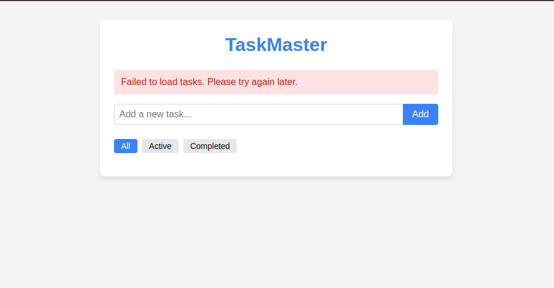
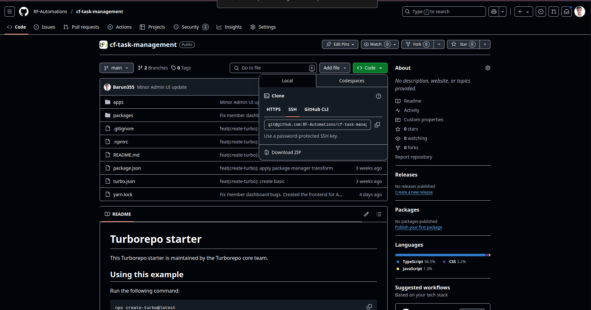

# **TODO** for REST API


### This is the basic TODO app to underatand the fundamental of API's how it works and the underlying architecture of REST API.





# Development setup
1. [Go to RF-Automation repo](https://github.com/rf-Automations/cf-task-management/)



2. Click on **<> code** button click it.
3. You will see **Download Zip** button.
4. Click on that you will get the zip file, unzip it.

### You will found two folders frontend & backend. You need to start live server under frontend folder and install the node dependencies in the backend folder to up and run the backend.

## Commands
1. Go to backend folder ```cd ./backend```
2. ```npm install``` it will install all the dependencies.
3. ```npm run dev``` it will start the development server.

# There you go.

Now you have your frontend and backend setup and you can test the apis and modify the backend to understand how things are working.

# [Task](./task.md)

# Prerequisites
1. HTML, CSS
2. JavaScript

# Don't worry if you don't have any of the Prerequisites
1. [JavaScript](https://www.youtube.com/playlist?list=PLu71SKxNbfoBuX3f4EOACle2y-tRC5Q37)

# Resource

1. [PostMan Blog to What is an API ?](http://postman.com/what-is-an-api)
2. [Simple Express server you can start with.](./express-server.md)
3. [Explanation of the express server code.](./explain-server.md)